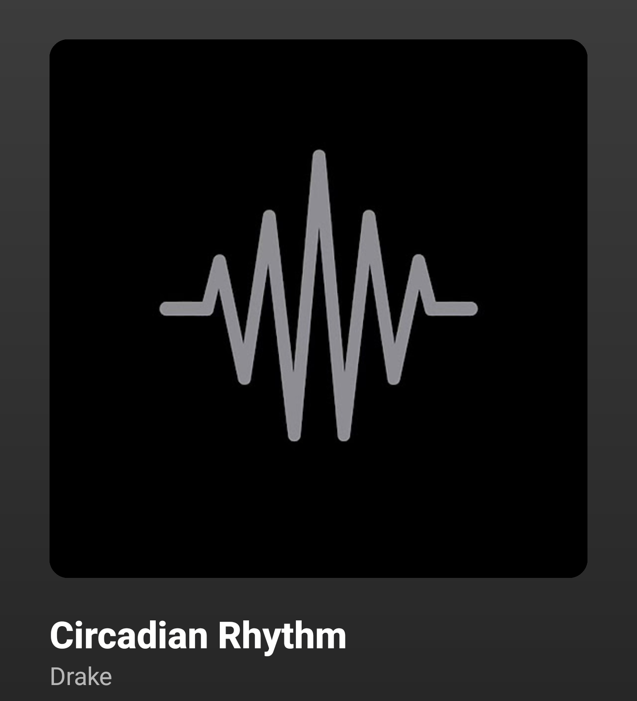
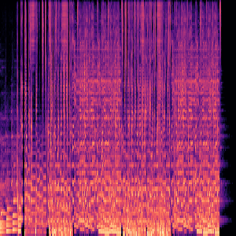
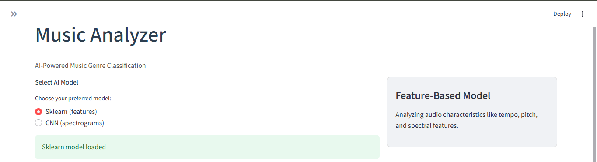
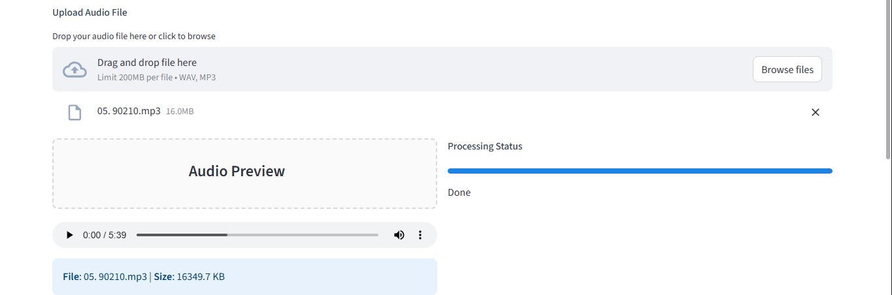
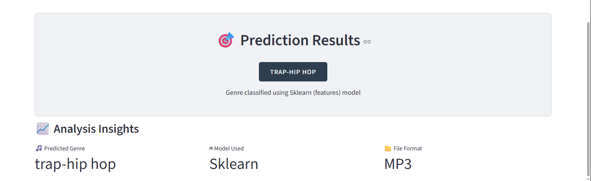

# Music-Analyzer 
==============

Music-Analyzer is a Python-based machine learning project for analyzing audio files and predicting their genres. It supports both **feature-based ML models** (Sklearn) and **image-based CNN models** using mel-spectrograms. The project also includes a **Streamlit web app** for easy demo and exploration.  

This project is an **upgrade and inspired by my first ML project**: [music_recommender](https://github.com/Longman-max/music_recommender.git)

---

## Sneak Peek

Check out a quick preview of the project:

<table>
  <tr>
    <td align="center">
      <b>Song</b><br/>
      
    </td>
    <td align="center">
      <b>Mel-Spectrogram Preview</b><br/>
      
    </td>
  </tr>
</table>


---

## Table of Contents

- [Features](#features)  
- [Project Structure](#project-structure)  
- [Installation](#installation)  
- [Dataset Preparation](#dataset-preparation)  
- [Training Models](#training-models)  
- [Using the Streamlit App](#using-the-streamlit-app)  
- [App Demo](#app-demo)  
- [File Organization & Git](#file-organization--git)  
- [Contributing](#contributing)  
- [License](#license)  


---

## Features

- Extracts audio features (MFCCs, Chroma, etc.) for ML models.  
- Generates mel-spectrogram images for CNN-based classification.  
- Supports multiple model types:
  - Sklearn model (`sklearn_model.pkl`) for classical ML.  
  - CNN model (`cnn_model.pth`) for deep learning on spectrograms.  
- Streamlit web app for uploading audio files and predicting genres.  
- Clean project structure for reproducibility and experimentation.  

---

## Project Structure

```

Music-Analyzer/
│
├─ data/
│  ├─ raw/             # Raw audio files (ignored by Git)
│  └─ processed/       # Processed features & spectrograms
│
├─ models/
│  ├─ sklearn\_model.pkl
│  └─ cnn\_model.pth
│
├─ src/
│  ├─ dataset\_builder.py   # Build features dataset and save CSV
│  ├─ train\_sklearn.py     # Train Sklearn ML model
│  ├─ train\_cnn.py         # Train CNN on mel-spectrograms
│  ├─ feature\_extraction.py# Extract audio features & save spectrograms
│  └─ app.py               # Streamlit demo app
│
├─ docs/
│  └─ images/              # Screenshots for README demo
│
├─ .gitignore
├─ requirements.txt
└─ README.md

````

---

## Installation

1. **Clone the repository**:

```bash
git clone https://github.com/Longman-max/Music-Analyzer.git
cd Music-Analyzer
````

2. **Create a virtual environment** (recommended):

```bash
python -m venv venv
source venv/bin/activate  # Linux/Mac
venv\Scripts\activate     # Windows
```

3. **Install dependencies**:

```bash
pip install -r requirements.txt
```

4. **Additional libraries** (if not included in `requirements.txt`):

```bash
pip install librosa numpy pandas scikit-learn torch torchvision matplotlib pillow streamlit
```

---

## Dataset Preparation

1. Place your raw audio files in `data/raw/`.

   * If you have genre folders, you can keep them as subfolders.
   * Example: `data/raw/rock/song1.wav`, `data/raw/jazz/song2.mp3`

2. **Build the dataset**:

```bash
python src/dataset_builder.py
```

* This extracts features for ML and generates mel-spectrograms for CNN.
* Features CSV is saved in `data/processed/features.csv`.
* Mel-spectrogram images are saved in `data/processed/melspecs/`.

---

## Training Models

### Sklearn (Classical ML)

```bash
python src/train_sklearn.py
```

* Trains a **Logistic Regression** classifier on extracted features.
* Saves the model, scaler, and label encoder in `models/sklearn_model.pkl`.

### CNN (Deep Learning)

```bash
python src/train_cnn.py
```

* Trains a **ResNet18** CNN on mel-spectrogram images.
* Saves model weights and class labels in `models/cnn_model.pth`.

---

## Using the Streamlit App

Run the app:

```bash
streamlit run src/app.py
```

**Features:**

* Upload a `.wav` or `.mp3` file.
* Choose between **Sklearn** or **CNN** models.
* View predicted genre and feature/spectrogram visualization.

**Layout highlights:**

* Clean, modern interface with sidebar model selection.
* Columns display predicted genre and spectrogram side by side for CNN.
* Feature vector expandable view for Sklearn predictions.

---

## App Demo

Here’s a quick walkthrough of the app in action:

### 1. Select a Model

Choose between **Sklearn** (feature-based) or **CNN** (spectrogram-based) from the sidebar.



---

### 2. Upload an Audio File

Upload a `.wav` or `.mp3` file to analyze.



---

### 3. View Predictions

The predicted genre is displayed along with the visualization:

* For **Sklearn**, you’ll see the extracted feature vector.
* For **CNN**, you’ll see the mel-spectrogram and predicted label.



---

## File Organization & Git

* **Ignore raw audio**: `data/raw/` is ignored via `.gitignore`.
* **Keep processed data**: `data/processed/` is tracked for reproducibility.
* **Ignore large models**: `models/*.pth`, `models/*.pkl` are ignored to reduce repo size.

**Remove already tracked raw files from Git**:

```bash
git rm -r --cached data/raw/
git commit -m "Stop tracking raw audio files"
```

---

## Contributing

* Fork the repo and create a feature branch.
* Ensure your code is clean and well-documented.
* Submit pull requests for review.

---

## License

This project is licensed under the MIT License. See `LICENSE` for details.
